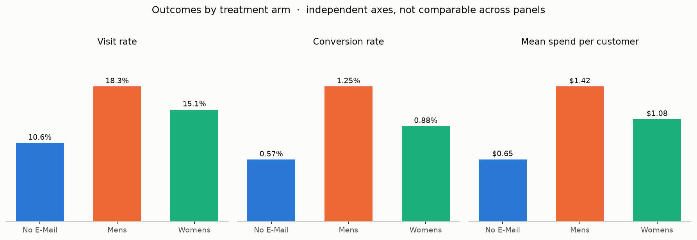
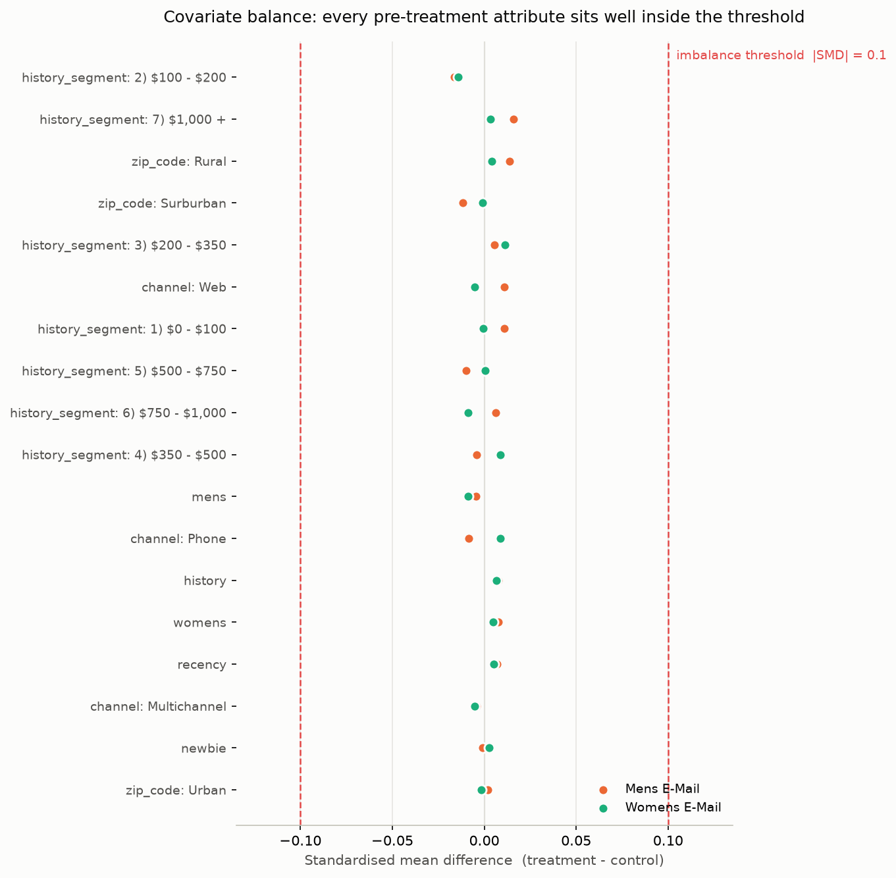
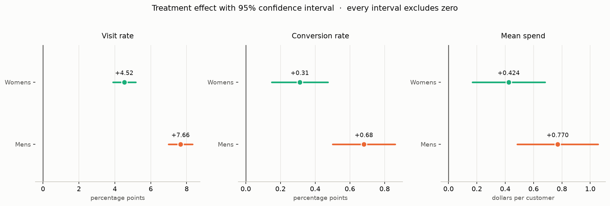

# ExperimentIQ

Causal experimentation and campaign-targeting platform built on the Hillstrom email
marketing experiment.

It answers four questions in order:

1. **Did the campaigns work?** — A/B analysis of a three-arm email experiment.
2. **Do I believe the result?** — randomisation diagnostics, power analysis, variance reduction.
3. **Who should receive which campaign?** — uplift modelling and a targeting policy.
4. **How should the budget be spent?** — profit-based allocation under a budget constraint.

---

## The experiment

64,000 customers were randomised into three arms:

| Arm | Customers |
|---|---:|
| Womens E-Mail | 21,387 |
| Mens E-Mail | 21,307 |
| No E-Mail | 21,306 |

Outcomes measured in the two weeks after the send: `visit`, `conversion`, `spend`.
Pre-treatment customer attributes: `recency`, `history_segment`, `history`, `mens`,
`womens`, `zip_code`, `newbie`, `channel`.

Source: [Kevin Hillstrom's MineThatData E-Mail Analytics Challenge](https://blog.minethatdata.com/2008/03/minethatdata-e-mail-analytics-and-data.html).

### Two design decisions worth stating up front

**The three-arm test is analysed as two two-arm tests.** Each email arm is compared
against the shared `No E-Mail` control. This keeps every method — t-tests, CUPED,
uplift learners — in its standard binary-treatment form rather than requiring
multi-treatment variants, and the multiplicity it introduces is corrected for
explicitly.

**The 6,562 duplicate rows are kept, not dropped.** The dataset carries no customer
identifier, and the feature space is coarse enough (8 mostly low-cardinality
attributes) that distinct customers can legitimately share an identical row. With no
way to distinguish a genuine collision from a true duplicate, removing them would
non-randomly delete customers with common attribute profiles and bias the arm
comparison. They are retained and the decision is documented rather than hidden.

---

## Roadmap

Each feature is built as a notebook first, then promoted to a module under `src/`,
and lands as its own commit.

- [x] **0 — Project setup.** Curated dependencies, configuration, repository hygiene.
- [x] **1 — Data layer.** Validated load to parquet with explicit data contracts.
- [x] **2 — DuckDB warehouse.** Analytical store and SQL metric views.
- [x] **3 — Experiment diagnostics.** Sample ratio mismatch, covariate balance.
- [x] **4 — A/B analysis.** Lifts, confidence intervals, significance with Holm correction.
- [ ] **5 — Power and MDE.** Achieved power and minimum detectable effects per outcome.
- [ ] **6 — CUPED.** Variance reduction using prior spend as the pre-period covariate.
- [ ] **7 — Heterogeneous effects.** Pre-registered subgroup analysis.
- [ ] **8 — Uplift models.** Meta-learners evaluated by Qini and uplift@k.
- [ ] **9 — Targeting policy.** Per-customer campaign assignment, evaluated out of sample.
- [ ] **10 — Budget optimiser.** Incremental-profit allocation under a budget constraint.
- [ ] **11 — Dashboard.** Streamlit application over the DuckDB warehouse.
- [ ] **12 — Final report.** Executive summary and results write-up.

---

## Where things stand



Both email arms sit above control on all three outcomes. Nothing is claimed about
significance yet — that is Feature 4, after the randomisation diagnostics in
Feature 3.

The outcomes form a strict funnel, verified to hold with zero exceptions:

```
visit = 1  ⊃  conversion = 1  ⟺  spend > 0
```

Which means `spend` is 99.1% zeros with a standard deviation roughly 14x its mean.
That single fact drives several later design decisions: the bootstrap interval in
Feature 4, the sample-size calculation in Feature 5, and the choice of `history` as
the CUPED covariate in Feature 6.

See [`notebooks/01_data_quality.ipynb`](notebooks/01_data_quality.ipynb) for the
full exploration.

### The randomisation holds



| Check | Result | Interpretation |
|---|---|---|
| Sample ratio mismatch | p = 0.90 | Arm sizes match the intended equal split |
| Covariate balance | max \|SMD\| = 0.016 | Every covariate far inside the 0.1 threshold |
| Omnibus balance | pseudo-R² = 0.0002 | Covariates jointly explain ~0% of assignment |

So differences between arms can be attributed to the emails rather than to
pre-existing differences between the customers who received them. The diagnostics
are shown to discriminate, not merely to pass: on a deliberately confounded copy of
the experiment the omnibus pseudo-R² rises ~950x, and the test suite asserts it.

See [`notebooks/03_randomisation_diagnostics.ipynb`](notebooks/03_randomisation_diagnostics.ipynb).

### Both campaigns worked



| Arm | Outcome | Effect | 95% CI | Relative | Holm p |
|---|---|---|---|---|---|
| Mens | Visit | +7.66 pp | [+7.00, +8.32] | +72% | 3e-111 |
| Mens | Conversion | +0.68 pp | [+0.50, +0.86] | +119% | 6e-13 |
| Mens | Spend | +$0.77 | [+0.49, +1.05] | +118% | 3e-07 |
| Womens | Visit | +4.52 pp | [+3.89, +5.16] | +43% | 2e-43 |
| Womens | Conversion | +0.31 pp | [+0.15, +0.47] | +54% | 3e-04 |
| Womens | Spend | +$0.42 | [+0.17, +0.68] | +65% | 1e-03 |

Every effect survives Holm correction across the six tests. Mens E-Mail is roughly
twice as effective as Womens E-Mail on visits and conversion.

Spend is 99.1% zeros with a standard deviation ~14x its mean, so Welch's interval was
checked against a 10,000-sample bootstrap rather than trusted: the two agree to within
a fraction of a cent. The *relative* effect on spend is far less certain than the
absolute one — Mens E-Mail's +118% carries an interval of [+64%, +196%], because a
ratio of two random means inherits the uncertainty of its denominator.

See [`notebooks/04_treatment_effects.ipynb`](notebooks/04_treatment_effects.ipynb).

---

## Repository layout

```
experimentiq/
├── data/
│   ├── raw/            # source CSV (version-controlled)
│   ├── processed/      # derived parquet (rebuilt, ignored)
│   └── database/       # DuckDB file (rebuilt, ignored)
├── notebooks/          # exploration, one per feature
├── src/
│   ├── config.py       # paths, experiment design, business assumptions
│   ├── data/load.py    # load, validate, derive, persist
│   ├── analysis/
│   │   ├── diagnostics.py  # SRM, covariate balance, omnibus balance
│   │   └── ab_test.py      # effect estimation, CIs, Holm correction
│   └── db/
│       ├── warehouse.py    # build and query the store
│       └── sql/            # view definitions, in dependency order
├── tests/              # data contracts and SQL-vs-pandas cross-checks
├── reports/
│   ├── figures/        # generated charts
│   └── results/        # generated result tables
├── conftest.py
└── requirements.txt
```

---

## Usage

Rebuild the processed dataset from the raw CSV, then the DuckDB warehouse:

```bash
python -m src.data.load
python -m src.db.warehouse
```

Run the randomisation diagnostics, then the treatment effect analysis:

```bash
python -m src.analysis.diagnostics
python -m src.analysis.ab_test
```

Query the warehouse:

```python
from src.db.warehouse import query, table

table("v_arm_metrics")
query("SELECT * FROM v_segment_metrics WHERE dimension = 'Recency'")
```

| View | Answers |
|---|---|
| `v_arm_metrics` | What did each arm do? |
| `v_arm_lift` | How much better than control, per outcome? |
| `v_funnel` | Where in the funnel does the effect sit? |
| `v_customer_dimensions` | Long-format customer attributes for slicing |
| `v_segment_metrics` | Outcome rates and lift per (dimension, level, arm) |

The views are descriptive by design. They report point estimates and no
uncertainty — inference lives in Python, where the standard errors are, not in SQL,
which makes it easy to compute a difference and awkward to compute the confidence
interval around it.

Run the test suite:

```bash
pytest
```

The tests do two jobs. They assert the published data satisfies its contracts, and —
more usefully — they corrupt copies of the data to assert that `validate` actually
rejects each violation. A contract that cannot fail is not a contract.

---

## Setup

Requires Python 3.11.

```bash
python3.11 -m venv venv
source venv/bin/activate
pip install -r requirements.txt
```

Verify the configuration resolves:

```bash
python -c "from src.config import RAW_CSV; print(RAW_CSV.exists())"
```

---

## Assumptions

The profit model in Feature 10 needs two numbers the dataset does not provide. They
are stated in `src/config.py` and exposed as adjustable inputs in the dashboard:

| Assumption | Value | Why it matters |
|---|---|---|
| Gross margin | 30% | Converts incremental revenue into incremental profit |
| Cost per email | $0.10 | Sets the break-even uplift for sending |

Conclusions about profit are conditional on these; conclusions about causal effect
are not.

---

## Licence

MIT — see [LICENSE](LICENSE).
