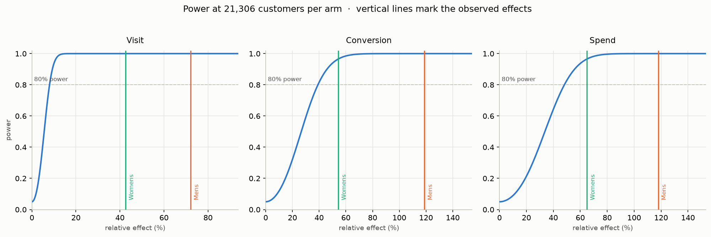
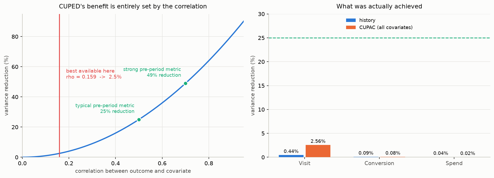
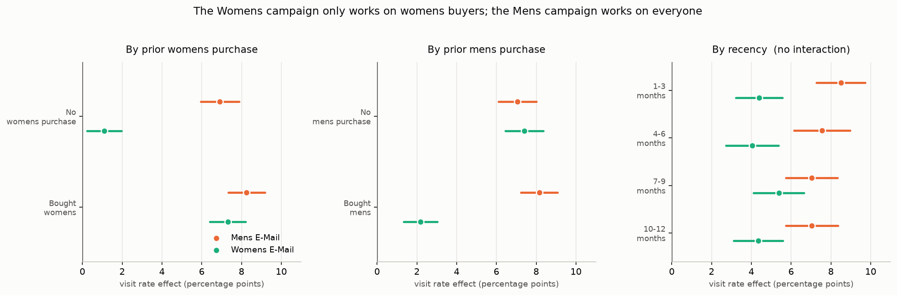
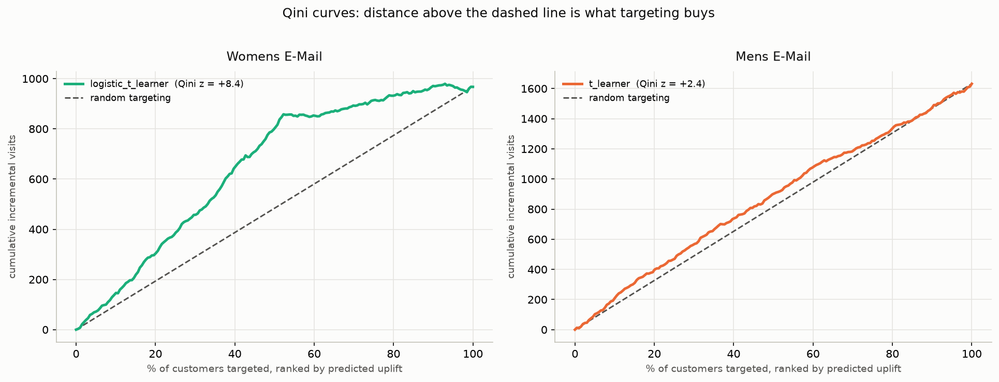
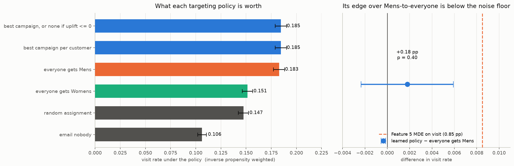
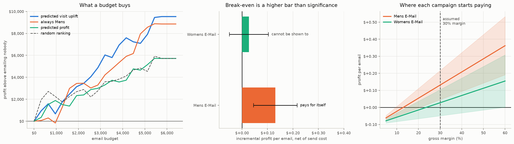

# ExperimentIQ

Causal experimentation and campaign-targeting platform built on the Hillstrom email
marketing experiment.

It answers four questions in order:

1. **Did the campaigns work?** — A/B analysis of a three-arm email experiment.
2. **Do I believe the result?** — randomisation diagnostics, power analysis, variance reduction.
3. **Who should receive which campaign?** — uplift modelling and a targeting policy.
4. **How should the budget be spent?** — profit-based allocation under a budget constraint.

---

## The experiment

64,000 customers were randomised into three arms:

| Arm | Customers |
|---|---:|
| Womens E-Mail | 21,387 |
| Mens E-Mail | 21,307 |
| No E-Mail | 21,306 |

Outcomes measured in the two weeks after the send: `visit`, `conversion`, `spend`.
Pre-treatment customer attributes: `recency`, `history_segment`, `history`, `mens`,
`womens`, `zip_code`, `newbie`, `channel`.

Source: [Kevin Hillstrom's MineThatData E-Mail Analytics Challenge](https://blog.minethatdata.com/2008/03/minethatdata-e-mail-analytics-and-data.html).

### Two design decisions worth stating up front

**The three-arm test is analysed as two two-arm tests.** Each email arm is compared
against the shared `No E-Mail` control. This keeps every method — t-tests, CUPED,
uplift learners — in its standard binary-treatment form rather than requiring
multi-treatment variants, and the multiplicity it introduces is corrected for
explicitly.

**The 6,562 duplicate rows are kept, not dropped.** The dataset carries no customer
identifier, and the feature space is coarse enough (8 mostly low-cardinality
attributes) that distinct customers can legitimately share an identical row. With no
way to distinguish a genuine collision from a true duplicate, removing them would
non-randomly delete customers with common attribute profiles and bias the arm
comparison. They are retained and the decision is documented rather than hidden.

---

## Roadmap

Each feature is built as a notebook first, then promoted to a module under `src/`,
and lands as its own commit.

- [x] **0 — Project setup.** Curated dependencies, configuration, repository hygiene.
- [x] **1 — Data layer.** Validated load to parquet with explicit data contracts.
- [x] **2 — DuckDB warehouse.** Analytical store and SQL metric views.
- [x] **3 — Experiment diagnostics.** Sample ratio mismatch, covariate balance.
- [x] **4 — A/B analysis.** Lifts, confidence intervals, significance with Holm correction.
- [x] **5 — Power and MDE.** Achieved power and minimum detectable effects per outcome.
- [x] **6 — CUPED.** Variance reduction using prior spend as the pre-period covariate.
- [x] **7 — Heterogeneous effects.** Pre-registered subgroup analysis.
- [x] **8 — Uplift models.** Meta-learners evaluated by Qini and uplift@k.
- [x] **9 — Targeting policy.** Per-customer campaign assignment, evaluated out of sample.
- [x] **10 — Budget optimiser.** Incremental-profit allocation under a budget constraint.
- [ ] **11 — Dashboard.** Streamlit application over the DuckDB warehouse.
- [ ] **12 — Final report.** Executive summary and results write-up.

---

## Where things stand


Both email arms sit above control on all three outcomes. Nothing is claimed about
significance yet — that is Feature 4, after the randomisation diagnostics in
Feature 3.

The outcomes form a strict funnel, verified to hold with zero exceptions:

```
visit = 1  ⊃  conversion = 1  ⟺  spend > 0
```

Which means `spend` is 99.1% zeros with a standard deviation roughly 14x its mean.
That single fact drives several later design decisions: the bootstrap interval in
Feature 4, the sample-size calculation in Feature 5, and the choice of `history` as
the CUPED covariate in Feature 6.

See [`notebooks/01_data_quality.ipynb`](notebooks/01_data_quality.ipynb) for the
full exploration.

### The randomisation holds


| Check | Result | Interpretation |
|---|---|---|
| Sample ratio mismatch | p = 0.90 | Arm sizes match the intended equal split |
| Covariate balance | max \|SMD\| = 0.016 | Every covariate far inside the 0.1 threshold |
| Omnibus balance | pseudo-R² = 0.0002 | Covariates jointly explain ~0% of assignment |

So differences between arms can be attributed to the emails rather than to
pre-existing differences between the customers who received them. The diagnostics
are shown to discriminate, not merely to pass: on a deliberately confounded copy of
the experiment the omnibus pseudo-R² rises ~950x, and the test suite asserts it.

See [`notebooks/03_randomisation_diagnostics.ipynb`](notebooks/03_randomisation_diagnostics.ipynb).

### Both campaigns worked


| Arm | Outcome | Effect | 95% CI | Relative | Holm p |
|---|---|---|---|---|---|
| Mens | Visit | +7.66 pp | [+7.00, +8.32] | +72% | 3e-111 |
| Mens | Conversion | +0.68 pp | [+0.50, +0.86] | +119% | 6e-13 |
| Mens | Spend | +$0.77 | [+0.49, +1.05] | +118% | 3e-07 |
| Womens | Visit | +4.52 pp | [+3.89, +5.16] | +43% | 2e-43 |
| Womens | Conversion | +0.31 pp | [+0.15, +0.47] | +54% | 3e-04 |
| Womens | Spend | +$0.42 | [+0.17, +0.68] | +65% | 1e-03 |

Every effect survives Holm correction across the six tests. Mens E-Mail is roughly
twice as effective as Womens E-Mail on visits and conversion.

Spend is 99.1% zeros with a standard deviation ~14x its mean, so Welch's interval was
checked against a 10,000-sample bootstrap rather than trusted: the two agree to within
a fraction of a cent. The *relative* effect on spend is far less certain than the
absolute one — Mens E-Mail's +118% carries an interval of [+64%, +196%], because a
ratio of two random means inherits the uncertainty of its denominator.

See [`notebooks/04_treatment_effects.ipynb`](notebooks/04_treatment_effects.ipynb).

### But the experiment was sized for a cruder question than it looks



| Outcome | MDE (absolute) | MDE (relative) | Assessment |
|---|---|---|---|
| Visit | 0.85 pp | 8.0% | Well powered; effects 5–9x the threshold |
| Conversion | 0.22 pp | 39.1% | Mens robust; Womens clears on the point estimate only |
| Spend | $0.31 | 48.2% | Mens robust; Womens clears on the point estimate only |

With 21,306 customers per arm this design could only detect a **39% relative change in
conversion** and a **48% change in spend**. It was built to answer "does email work at
all", and answers that emphatically. It could never have answered "is this variant 10%
better" — that needs 286,000 customers per arm for conversion and 495,000 for spend,
because halving the effect you want to detect quadruples the sample required.

Robustness is judged by comparing the *lower bound* of each effect's confidence
interval against the MDE, rather than by computing power at the observed effect —
[that number is circular](reports/figures/05_observed_power_fallacy.png), being a
monotone function of the p-value and so carrying no independent information. On that
test four of six results are robust; Womens E-Mail on conversion and spend clear the
threshold on their point estimate but not on their interval.

See [`notebooks/05_power_analysis.ipynb`](notebooks/05_power_analysis.ipynb).

### CUPED cannot rescue it, and the reason is diagnosable



CUPED removes exactly ρ² of the outcome variance — an identity, not a rule of thumb —
so the technique cannot be argued into working. The best correlation available in this
dataset is 0.159, giving a **2.6% variance reduction on visit** and **0.04% on spend**.
Against Feature 5's requirement of 23x more customers, CUPED supplies 1.0004x.

The implementation is verified against synthetic data with known ρ, where it recovers
the theoretical reduction to three decimals — so the null result is a fact about the
data rather than a bug. The cause is specific: `history` is coarsely-bucketed lifetime
spend, not a pre-period measurement of the outcome. Real CUPED deployments use last
period's value of the *same* metric, which typically correlates 0.5–0.9.

**The actionable finding is about instrumentation, not analysis:** logging each
customer's spend over a fixed pre-experiment window would plausibly correlate 0.4–0.6
and cut variance 16–36%, at the cost of one table.

Two things worth noting. CUPAC — replacing the single covariate with a cross-fitted
model over all pre-treatment features — helps on visit (ρ 0.067 → 0.159) but *hurts*
on spend (0.021 → 0.014): with no signal to find, out-of-fold predictions are mostly
fitted noise. And CUPED changed no conclusion from Feature 4, which is exactly how a
correct implementation should behave on data that offers it no purchase.

See [`notebooks/06_cuped.ipynb`](notebooks/06_cuped.ipynb).

### One campaign is targetable, the other is not



| Question | Answer |
|---|---|
| Does the Mens campaign vary by customer? | No — 7.1 to 8.2 pp in every subgroup |
| Does the Womens campaign vary? | Strongly — 1.1 to 7.3 pp by purchase history |
| Is anyone actively harmed? | Not detectably at subgroup resolution |

The **Womens** campaign lifts visits by 7.31 pp among customers who previously bought
womens merchandise and 1.11 pp among those who did not — a 6.6x gap with
non-overlapping intervals (interaction F = 94, p < 1e-10). The **Mens** campaign shows
no significant interaction with any pre-registered subgroup: it works about equally
well on everyone.

That asymmetry bounds what personalisation can achieve. There is little for a targeting
model to exploit on the Mens campaign; the opportunity is in deciding who receives the
*Womens* campaign and in choosing between the two.

Subgroups were pre-registered in `config.py` with a rationale each, before any effect
was estimated. Heterogeneity is tested by **interaction**, not by comparing per-subgroup
p-values — two estimates can straddle a significance threshold while being
indistinguishable from each other, and the test suite asserts both directions of that
error. Interactions cost roughly 4x the sample of a main effect, which is why `visit`
carries the primary analysis and the other outcomes are flagged underpowered.

See [`notebooks/07_heterogeneous_effects.ipynb`](notebooks/07_heterogeneous_effects.ipynb).

### Uplift models confirm it, and the simplest model wins



| | Womens E-Mail | Mens E-Mail |
|---|---|---|
| Learners beating random | **5 of 5** | 1 of 5 |
| Qini z-score range | +7.55 to +8.43 | −0.32 to +2.43 |
| Best Qini | 0.064 | 0.019 |

Feature 7 predicted this before any model was fitted: strong signal on Womens, almost
none on Mens. Five different meta-learners agree on Womens; four of five find nothing
on Mens, and the one that clears significance does so at an adjusted p of 0.037 after
being picked as best of five — which is what noise looks like when you search for it.

The **logistic T-learner** scores highest (Qini 0.0641), beating every gradient-boosted
variant. The heterogeneity is driven by one binary attribute, and a linear model
captures a step function exactly; boosting adds only variance. Profiling the top uplift
deciles recovers *prior womens purchase* independently — the model rediscovered
Feature 7's mechanism without being told.

Two guards make the result trustworthy. Every prediction is **out-of-fold**: on data
built with no heterogeneity at all, in-sample scoring yields Qini 0.578 against an
honest 0.012, a 47x inflation from leakage alone. And every Qini is scored against a
**null distribution of 500 random rankings**, because Qini is high-variance and a model
that learned nothing still returns a non-zero score more often than not.

See [`notebooks/08_uplift_models.ipynb`](notebooks/08_uplift_models.ipynb).

### The targeting policy is right about *who*, and it does not matter



| Question | Answer |
|---|---|
| Best policy by point estimate | Best campaign per customer — 0.1845 |
| Does it beat "send Mens to everyone"? | **No** — +0.18 pp, CI [−0.23, +0.59], p = 0.40 |
| Does it pick the right arm? | **Yes** — correct in both assignment groups |
| Was that gain ever detectable? | No — roughly 5x below Feature 5's MDE |

Policies are valued by **inverse propensity weighting**. A customer received one arm;
their outcome under the others was never observed, so a policy that would have assigned
them differently cannot be evaluated by filtering. Randomisation supplies known
assignment probabilities, and reweighting the customers whose actual arm matches the
policy reconstructs the full population without bias. The estimator is verified against
an exact identity — "send arm A to everyone" reproduces arm A's observed mean to 1e-16.

The learned policy sends Mens to 70% of customers and Womens to 30%, and its decisions
audit as **correct**: among the 44,914 it assigns Mens the measured Mens effect is
+7.91 pp against Womens' +3.24 pp; among the 19,086 it assigns Womens the ordering
genuinely flips, +7.53 pp against +7.03 pp. That audit uses observed outcomes only, no
model.

But the second gap is half a percentage point on 30% of the file, so the population
gain is ~0.15 pp — about **5x below the smallest effect this experiment was built to
detect**. The honest conclusion is not "personalisation does not work" but *this
experiment cannot resolve whether it does*; separating those two takes a power argument,
because they support opposite decisions. Comparisons are run **paired** — the two
policies agree on 44,914 customers and those contribute exactly zero noise — which
makes the test 1.9x more precise and confirms the null is real rather than an artifact
of a loose standard error.

**What a business should do:** send the Mens campaign to everyone. It captures 18.3 of
the 18.5 points the learned policy achieves, with no model, no scoring pipeline and no
monitoring. Two caveats: the outcome here is *visits*, not profit, and the `none` action
is never selected because every customer has positive predicted visit uplift. Feature 10
redoes both on incremental profit, where a $0.10 send cost sets a positive break-even
threshold and withholding becomes a live option.

See [`notebooks/09_targeting_policy.ipynb`](notebooks/09_targeting_policy.ipynb).

### In money, one campaign is a decision and the other is a coin flip



| | Mens E-Mail | Womens E-Mail |
|---|---|---|
| Profit per email, net of send cost | **+$0.131** | +$0.027 |
| 95% interval | [+$0.046, +$0.216] | [−$0.049, +$0.104] |
| Break-even margin | 13.0% | 23.6% |
| ...on pessimistic assumptions | **20.6%** | **59.2%** |

An email costs $0.10 and returns 30% of the incremental spend it causes, so it has to
generate **$0.33 of extra spend just to break even** — a much higher bar than "the
campaign has a positive effect", which is all Feature 4 established. Both campaigns
cleared significance on spend. Only Mens clears break-even with an interval that excludes
zero. Womens lifts spend $0.42 ± $0.26 against a $0.33 threshold, which is not a
decision.

The last row is what a planning conversation actually needs: **Mens stays profitable down
to a 20.6% gross margin even if its true effect sits at the pessimistic end of its
interval.** Womens would need 59.2% under the same pessimism. The break-even margin
depends only on the spend effect and the send cost, never on the margin you assume, which
is why it is the number worth quoting.

Profit is handled as a *column* — `margin × spend − cost × emailed` — not a new
estimator. Control customers carry no cost, so the arm-minus-control difference in that
column is incremental profit with the send cost already netted out, and Feature 4's Welch
intervals and Feature 9's IPW apply unchanged. Allocation is greedy, which for equal send
costs is **exactly optimal rather than a heuristic**; the test suite brute-forces it
against every subset instead of leaving that as a claim.

**The methodological result is the transferable one.** Two uplift models, same data, same
code. The visit model passed Feature 8's null test; ranking the budget by it is
indistinguishable from using no model (+$675, p = 0.65) — harmless. The spend model
failed that null test; ranking by it **loses $3,140** against simply sending Mens to
everyone (p = 0.034), because it reassigns 13,850 customers away from the campaign
Feature 4 had already shown was twice as effective. *The cost of deploying an unvalidated
model is not zero.*

**What a business should do:** send Mens to as many customers as the budget covers. Every
budget dollar returns ~$1.74 of incremental profit, no curve turns over before a full
send, and no ranking tested improves on spending it uniformly. Withholding email from the
9,119 customers below break-even is worth the $912 of certain cost saving and nothing
demonstrable beyond it (+$476, p = 0.54).

See [`notebooks/10_budget_optimiser.ipynb`](notebooks/10_budget_optimiser.ipynb).

---

## Repository layout

```
experimentiq/
├── data/
│   ├── raw/            # source CSV (version-controlled)
│   ├── processed/      # derived parquet (rebuilt, ignored)
│   └── database/       # DuckDB file (rebuilt, ignored)
├── notebooks/          # exploration, one per feature
├── src/
│   ├── config.py       # paths, experiment design, business assumptions
│   ├── data/load.py    # load, validate, derive, persist
│   ├── analysis/
│   │   ├── diagnostics.py  # SRM, covariate balance, omnibus balance
│   │   ├── ab_test.py      # effect estimation, CIs, Holm correction
│   │   ├── power.py        # MDE, power curves, required sample size
│   │   ├── cuped.py        # variance reduction, ANCOVA, CUPAC
│   │   └── heterogeneity.py  # pre-registered subgroups, interaction tests
│   ├── models/
│   │   ├── uplift.py       # meta-learners, Qini vs a random-ranking null
│   │   ├── policy.py       # assignment policies, off-policy value via IPW
│   │   └── budget.py       # profit model, break-even, greedy allocation
│   └── db/
│       ├── warehouse.py    # build and query the store
│       └── sql/            # view definitions, in dependency order
├── tests/              # data contracts and SQL-vs-pandas cross-checks
├── reports/
│   ├── figures/        # generated charts
│   └── results/        # generated result tables
├── conftest.py
└── requirements.txt
```

---

## Usage

Rebuild the processed dataset from the raw CSV, then the DuckDB warehouse:

```bash
python -m src.data.load
python -m src.db.warehouse
```

Run the randomisation diagnostics, then the treatment effect analysis:

```bash
python -m src.analysis.diagnostics
python -m src.analysis.ab_test
python -m src.analysis.power
python -m src.analysis.cuped
python -m src.analysis.heterogeneity
python -m src.models.uplift
python -m src.models.policy
python -m src.models.budget
```

Query the warehouse:

```python
from src.db.warehouse import query, table

table("v_arm_metrics")
query("SELECT * FROM v_segment_metrics WHERE dimension = 'Recency'")
```

| View | Answers |
|---|---|
| `v_arm_metrics` | What did each arm do? |
| `v_arm_lift` | How much better than control, per outcome? |
| `v_funnel` | Where in the funnel does the effect sit? |
| `v_customer_dimensions` | Long-format customer attributes for slicing |
| `v_segment_metrics` | Outcome rates and lift per (dimension, level, arm) |

The views are descriptive by design. They report point estimates and no
uncertainty — inference lives in Python, where the standard errors are, not in SQL,
which makes it easy to compute a difference and awkward to compute the confidence
interval around it.

Run the test suite:

```bash
pytest
```

The tests do two jobs. They assert the published data satisfies its contracts, and —
more usefully — they corrupt copies of the data to assert that `validate` actually
rejects each violation. A contract that cannot fail is not a contract.

---

## Setup

Requires Python 3.11.

```bash
python3.11 -m venv venv
source venv/bin/activate
pip install -r requirements.txt
```

Verify the configuration resolves:

```bash
python -c "from src.config import RAW_CSV; print(RAW_CSV.exists())"
```

---

## Assumptions

The profit model in Feature 10 needs two numbers the dataset does not provide. They
are stated in `src/config.py` and exposed as adjustable inputs in the dashboard:

| Assumption | Value | Why it matters |
|---|---|---|
| Gross margin | 30% | Converts incremental revenue into incremental profit |
| Cost per email | $0.10 | Sets the break-even uplift for sending |

Conclusions about profit are conditional on these; conclusions about causal effect
are not. Feature 10 reports how much the conditioning actually costs: the Mens
campaign's verdict is unchanged anywhere above a 20.6% margin, so the assumption is not
load-bearing there. The Womens campaign's verdict flips inside the plausible range, so
for that arm the assumption *is* the answer — which is why the break-even margin is
reported alongside every profit figure rather than a single point estimate.

---

## Licence

MIT — see [LICENSE](LICENSE).
